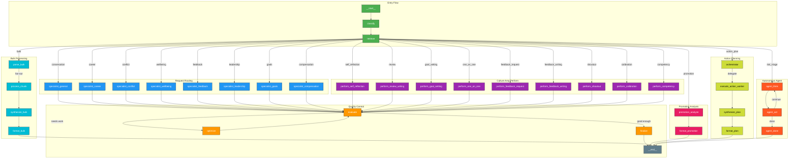

# HR Platform Graph Architecture

```mermaid
graph TD
    subgraph Entry["Entry Flow"]
        START[__start__] --> classify
        classify --> retrieve
    end

    subgraph Routing["Request Routing"]
        retrieve --> |conversation| specialist_general
        retrieve --> |career| specialist_career
        retrieve --> |conflict| specialist_conflict
        retrieve --> |wellbeing| specialist_wellbeing
        retrieve --> |feedback| specialist_feedback
        retrieve --> |leadership| specialist_leadership
        retrieve --> |goals| specialist_goals
        retrieve --> |compensation| specialist_compensation
    end

    subgraph Perform["Culture Amp Perform"]
        retrieve --> |self_reflection| perform_self_reflection
        retrieve --> |review| perform_review_writing
        retrieve --> |goal_setting| perform_goal_setting
        retrieve --> |one_on_one| perform_one_on_one
        retrieve --> |feedback_request| perform_feedback_request
        retrieve --> |feedback_writing| perform_feedback_writing
        retrieve --> |shoutout| perform_shoutout
        retrieve --> |calibration| perform_calibration
        retrieve --> |competency| perform_competency
    end

    subgraph Quality["Quality Control"]
        specialist_general --> evaluate
        specialist_career --> evaluate
        specialist_conflict --> evaluate
        specialist_wellbeing --> evaluate
        specialist_feedback --> evaluate
        specialist_leadership --> evaluate
        specialist_goals --> evaluate
        specialist_compensation --> evaluate
        perform_self_reflection --> evaluate
        perform_review_writing --> evaluate
        perform_goal_setting --> evaluate
        perform_one_on_one --> evaluate
        perform_feedback_request --> evaluate
        perform_feedback_writing --> evaluate
        perform_shoutout --> evaluate
        perform_calibration --> evaluate
        perform_competency --> evaluate
        evaluate --> |needs work| optimize
        evaluate --> |good enough| finalize
        optimize --> evaluate
        finalize --> END[__end__]
    end

    subgraph Bulk["Bulk Processing"]
        retrieve --> |bulk| parse_bulk
        parse_bulk --> |fan-out| process_chunk
        process_chunk --> synthesize_bulk
        synthesize_bulk --> format_bulk
        format_bulk --> END
    end

    subgraph Promotion["Promotion Analysis"]
        retrieve --> |promotion| promotion_analyze
        promotion_analyze --> format_promotion
        format_promotion --> END
    end

    subgraph Planning["Action Planning"]
        retrieve --> |action_plan| orchestrator
        orchestrator --> |delegate| execute_action_worker
        execute_action_worker --> synthesize_plan
        synthesize_plan --> format_plan
        format_plan --> END
    end

    subgraph Agent["Autonomous Agent"]
        retrieve --> |risk_triage| agent_think
        agent_think --> agent_act
        agent_act --> |continue| agent_think
        agent_act --> |done| agent_done
        agent_done --> END
    end

    %% Styling
    classDef entry fill:#4CAF50,stroke:#333,color:#fff
    classDef specialist fill:#2196F3,stroke:#333,color:#fff
    classDef perform fill:#9C27B0,stroke:#333,color:#fff
    classDef quality fill:#FF9800,stroke:#333,color:#fff
    classDef bulk fill:#00BCD4,stroke:#333,color:#fff
    classDef promotion fill:#E91E63,stroke:#333,color:#fff
    classDef planning fill:#CDDC39,stroke:#333,color:#000
    classDef agent fill:#FF5722,stroke:#333,color:#fff
    classDef endpoint fill:#607D8B,stroke:#333,color:#fff

    class START,classify,retrieve entry
    class specialist_general,specialist_career,specialist_conflict,specialist_wellbeing,specialist_feedback,specialist_leadership,specialist_goals,specialist_compensation specialist
    class perform_self_reflection,perform_review_writing,perform_goal_setting,perform_one_on_one,perform_feedback_request,perform_feedback_writing,perform_shoutout,perform_calibration,perform_competency perform
    class evaluate,optimize,finalize quality
    class parse_bulk,process_chunk,synthesize_bulk,format_bulk bulk
    class promotion_analyze,format_promotion promotion
    class orchestrator,execute_action_worker,synthesize_plan,format_plan planning
    class agent_think,agent_act,agent_done agent
    class END endpoint
```
